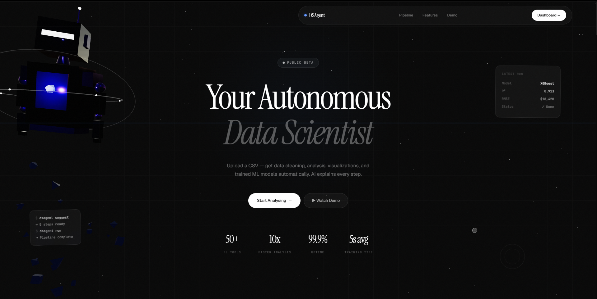
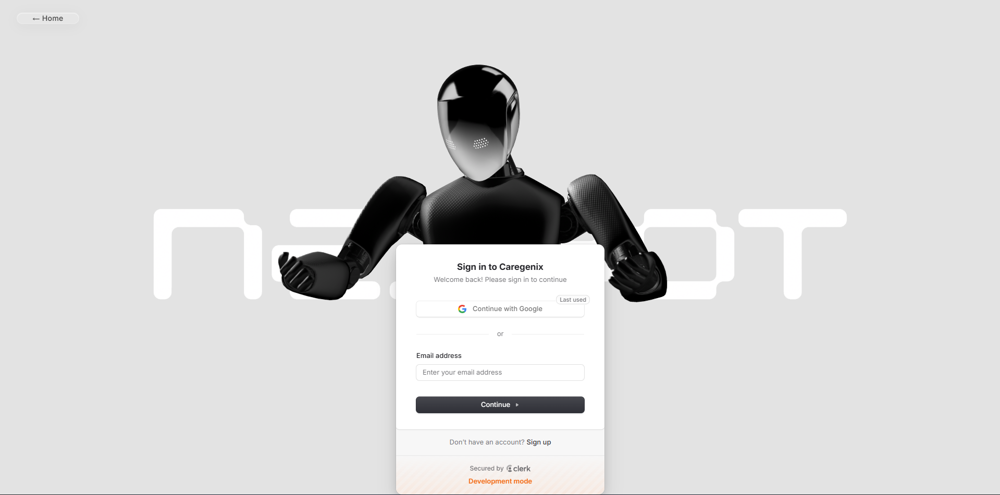
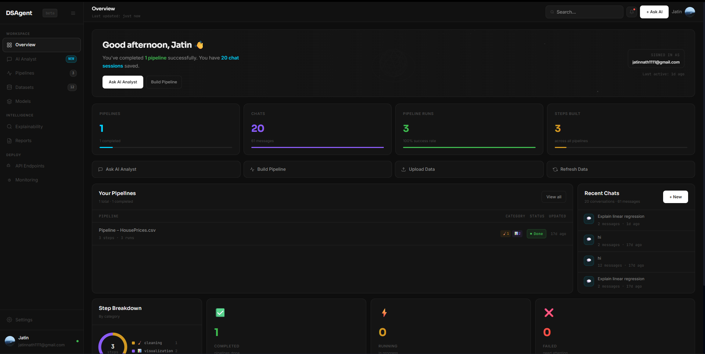
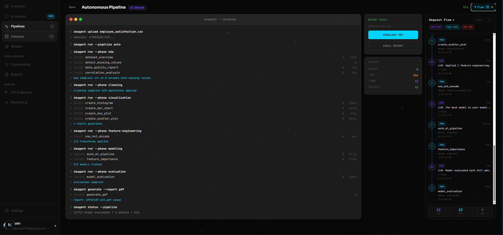
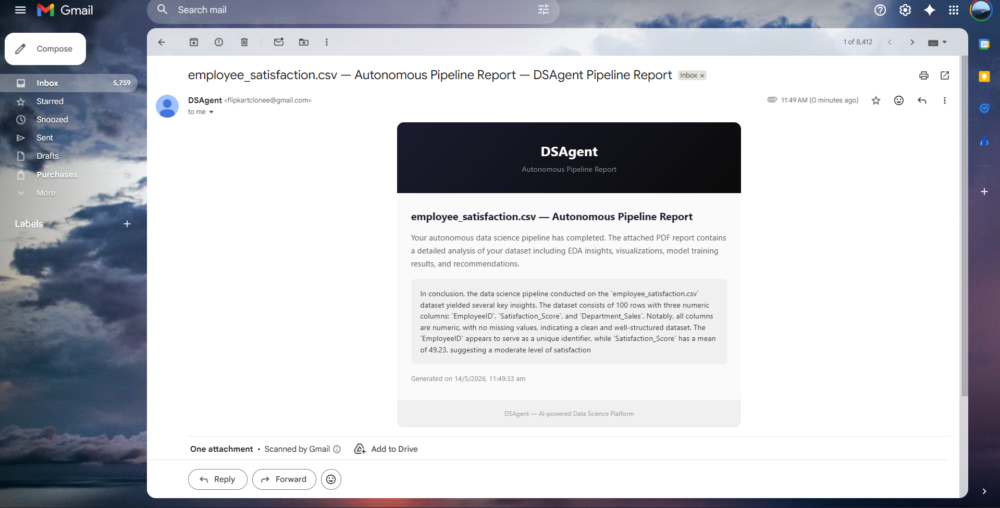
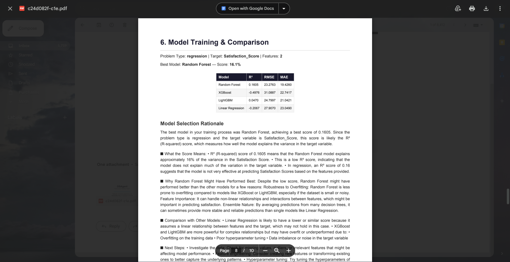

<div align="center">

# DSAgent

**Your Autonomous Data Scientist — Upload a CSV, get cleaning, analysis, visualizations, and trained ML models automatically.**

[](https://nextjs.org/)
[](https://fastapi.tiangolo.com/)
[](https://python.org/)
[](https://www.prisma.io/)
[](https://clerk.com/)

</div>






<h3 align="center">Under work  view at <a href="https://jatin-dsagent.vercel.app/">jatin-dsagent.vercel.app</a></h3>
<p align="center">
  


</p>

---

## Table of Contents

- [Overview](#overview)
- [Architecture](#architecture)
- [Implemented Features](#implemented-features)
  - [AI Analyst Chat](#ai-analyst-chat)
  - [Pipeline Builder](#pipeline-builder)
  - [Autonomous Pipeline](#autonomous-pipeline)
  - [Model Management & Export](#model-management--export)
  - [PDF Report Generation & Email Delivery](#pdf-report-generation--email-delivery)
  - [Landing Page](#landing-page)
  - [Dashboard](#dashboard)
- [Backend — Tools & ML](#backend--tools--ml)
  - [Data Cleaning Tools](#data-cleaning-tools)
  - [EDA Tools](#eda-tools)
  - [Visualization Tools](#visualization-tools)
  - [ML Modeling Tools](#ml-modeling-tools)
  - [Preprocessing & Feature Engineering](#preprocessing--feature-engineering)
  - [AI Agent (ReAct Pattern)](#ai-agent-react-pattern)
- [Tech Stack](#tech-stack)
- [API Endpoints](#api-endpoints)
- [Project Structure](#project-structure)
- [Roadmap](#roadmap)

---

## Overview

DSAgent is an **AI-powered data science platform** that automates the full ML workflow — from raw CSV upload to trained, compared models. It combines a **Next.js 16 frontend** with a **FastAPI + Python ML backend**, connected through an LLM-powered **ReAct agent** that reasons about your data and calls real tools (not hallucinated code).

**Key differentiators:**
- **Real tool execution** — The AI doesn't generate code snippets; it calls registered Python tools with actual pandas/sklearn operations.
- **ReAct loop** — Reasoning + Acting pattern: the agent thinks, acts, observes results, and iterates.
- **Autonomous Pipeline** — One-click, fully automated data science run (EDA → Cleaning → Visualization → Feature Engineering → Modeling → Evaluation) with a live terminal UI.
- **PDF Reports & Email** — Every autonomous run generates a downloadable PDF report that can be emailed directly to the user via SMTP.
- **Dark-themed visualizations** — All charts are generated server-side with matplotlib in a consistent dark aesthetic.
- **Visual pipeline builder** — Drag-and-drop data science workflows with AI-suggested steps.
- **Full persistence** — Every chat, pipeline, run, and report is stored in PostgreSQL via Prisma.

---

## Architecture

```
┌──────────────────────────────────────────────────────────────────┐
│                       FRONTEND (Next.js 16)                      │
│  ┌──────────┐  ┌──────────────────────────────┐  ┌───────────┐  │
│  │ Landing  │  │          Dashboard            │  │   Auth    │  │
│  │ (3D/R3F) │  │  Overview · Chat · Pipelines  │  │  (Clerk)  │  │
│  └──────────┘  └──────────────────────────────┘  └───────────┘  │
│                                                                  │
│   Components: AgentChat · PipelineBuilder · AutonomousPipeline   │
│                                                                  │
│   API Routes:                                                    │
│     /api/llm/run          /api/chats           /api/pipelines    │
│     /api/pipelines/autonomous                 /api/reports       │
│     /api/pipelines/suggest   /api/reports/[id]/email             │
├──────────────────────────────────────────────────────────────────┤
│                    BACKEND (FastAPI / Python)                     │
│  ┌──────────────────────────────────────────────────────────┐    │
│  │  Tool Registry (30+ registered tools)                   │    │
│  │  ┌──────────┐ ┌─────┐ ┌──────┐ ┌──────────────────────┐│    │
│  │  │ Cleaning │ │ EDA │ │ Viz  │ │ Modeling / AutoML    ││    │
│  │  └──────────┘ └─────┘ └──────┘ └──────────────────────┘│    │
│  │  ┌───────────────┐  ┌──────────────────────────────────┐│    │
│  │  │ Preprocessing │  │  Autonomous Pipeline + PDF Gen   ││    │
│  │  └───────────────┘  └──────────────────────────────────┘│    │
│  │  ┌──────────────────────────────────────────────────────┐│    │
│  │  │            Agent (ReAct + LLM)                      ││    │
│  │  └──────────────────────────────────────────────────────┘│    │
│  └──────────────────────────────────────────────────────────┘    │
├──────────────────────────────────────────────────────────────────┤
│  DATABASE: PostgreSQL (Prisma ORM)                               │
│  Models: User, Chat, Message, Pipeline, PipelineRun, Report      │
└──────────────────────────────────────────────────────────────────┘
```

---

## Implemented Features

### AI Analyst Chat

A fully functional conversational AI data analyst. Upload a CSV and have a back-and-forth conversation with DSAgent about your data.

**How it works:**
1. **Upload CSV** — Auto-extracts metadata (row/column counts, types, nulls, sample rows).
2. **Ask questions** — e.g. "What are the key correlations?" or "Train a model to predict price."
3. **Agent executes real tools** — Calls `correlation_analysis`, `create_histogram`, `auto_ml_pipeline`, etc.
4. **Results inline** — Charts rendered as base64 PNGs directly in the chat, alongside statistical summaries.

**Capabilities:**
- Dataset upload with drag-and-drop or file picker
- LLM-powered responses via Anthropic Claude (proxied through `/api/llm/run`)
- Tool calling — the LLM sees all 30+ registered tools and can invoke them
- Inline chart rendering — histograms, scatter plots, heatmaps displayed in chat
- Persistent chat history — all chats stored in PostgreSQL with per-user isolation (Clerk auth)
- Session resume — reload a chat and the dataset context is restored from disk
- Modified CSV download — download the dataset after cleaning/transform steps have been applied

---

### Pipeline Builder

A visual drag-and-drop interface for composing reusable data science workflows.

**How it works:**
1. **Upload a dataset** — Metadata extracted and displayed.
2. **Add steps** from the tool catalog, organized by category: Cleaning, EDA, Visualization, Modeling.
3. **AI suggests steps** — Click "AI Suggest" and the LLM analyzes your dataset metadata to recommend a pipeline.
4. **Configure each step** — Set parameters (column names, strategies, thresholds).
5. **Run the pipeline** — Executes all steps sequentially against the FastAPI backend.
6. **Save & re-run** — Pipelines are persisted to PostgreSQL; re-run on new datasets.

**Capabilities:**
- Category-coded steps — color-coded by type (Cleaning, EDA, Visualization, Modeling)
- AI-suggested pipelines — LLM reads dataset metadata and proposes an optimal sequence
- Sequential execution — runs each step via `/execute-tool`, displays pass/fail per step
- Run history — every pipeline run is recorded with per-step results and timing
- Edit existing pipelines — open, modify, re-save, re-run
- Delete pipelines — clean up with confirmation dialog
- Step result preview — see tool output and charts inline after each run

---

### Autonomous Pipeline

A one-click, **fully automated end-to-end data science run** driven entirely by the LLM — no manual step configuration needed.

**How it works:**
1. **Upload CSV** — Session created as usual.
2. **Click RUN PIPELINE** — A single API call to `/api/pipelines/autonomous` triggers the backend.
3. **Backend orchestrates 6 phases automatically** — LLM plans each phase, tool registry executes:
   - `eda` → `cleaning` → `visualization` → `feature_engineering` → `modeling` → `evaluation`
4. **Live terminal UI** — A macOS-style terminal window streams real-time phase commands and per-step pass/fail results with timing.
5. **Request Flow sidebar** — Collapsible animated sidebar showing every LLM call and tool execution as a live timeline with counts and durations.
6. **Completion summary** — After all phases finish, a stats panel shows total phases, steps, successes, and elapsed time.
7. **PDF report auto-generated** — A report is produced server-side and persisted to the `Report` database model.

**Capabilities:**
- 6-phase auto-orchestration with no user input required
- Live terminal with macOS chrome (traffic-light dots, blinking cursor)
- Per-step `[index/total]` progress with ✓/✗ success indicators and millisecond timing
- Phase-level metric summary lines (e.g. best model name + score, accuracy, R², chart count)
- Elapsed live timer while running (updates every 100ms)
- Request Flow sidebar — animated node timeline distinguishing **LLM**, **Tool**, and **Upload** event types
- Retry button on failure
- Result panel: Download PDF + Email Report buttons once complete
- **Pipeline database persistence** — Every autonomous run creates a `Pipeline` + `PipelineRun` record, visible in the Pipelines tab with an **AI** badge.
- **Model auto-save** — The best-performing model from AutoML is automatically persisted to disk (see [Model Management](#model-management--export) below).

---

### Model Management & Export

Trained models are **automatically persisted** after every AutoML run — both autonomous and guided pipelines. The best-performing model is saved to disk and surfaced in a dedicated **Models** dashboard tab.

**How it works:**
1. **AutoML trains models** — Random Forest, XGBoost, LightGBM, and Logistic/Linear Regression are trained with k-fold cross-validation.
2. **Best model auto-saved** — The winning model is serialized via `pickle` alongside a JSON metadata file containing metrics, feature names, transform steps, and problem type.
3. **Models tab** — A dedicated dashboard view lists all saved models with stats (Total, Classification, Regression, Best Score), sortable by creation date.
4. **Download bundle** — Each model can be downloaded as a `.zip` containing:
   - `model.pkl` — The serialized scikit-learn / XGBoost / LightGBM model
   - `transform.py` — A standalone Python script that replicates all preprocessing steps (scaling, encoding, imputation) applied during the pipeline, enabling consistent inference outside DSAgent
   - `README.md` — Usage instructions for CLI and programmatic prediction
5. **Delete models** — Remove models from storage with a confirmation dialog.

**Capabilities:**
- Automatic persistence after every `auto_ml_pipeline` tool execution
- Metadata includes: model name, problem type, target column, feature names, best score, all metrics, preprocessing transform steps, timestamps
- Standalone `transform.py` generation — encapsulates the full preprocessing pipeline for production deployment
- ZIP bundle download via `/api/models/{id}/download`
- Classification and regression model support
- Per-model metric cards: accuracy, precision, recall, F1 (classification) or R², RMSE, MAE (regression)

**API surface:**
| Method | Endpoint | Description |
|--------|----------|-------------|
| `GET` | `/api/models` | List all saved models with metadata |
| `GET` | `/api/models/[modelId]/download` | Download model ZIP bundle (pkl + transform.py + README) |
| `DELETE` | `/api/models/[modelId]` | Delete a saved model from disk |

---

### PDF Report Generation & Email Delivery

Every autonomous pipeline run produces a **PDF report** and offers one-click **email delivery**.
A
**Report generation:**
- Backend generates a structured PDF (report ID, path, file size) at the end of the autonomous pipeline.
- Report metadata (report ID, phases, total time, conclusion) is persisted to the `Report` model in PostgreSQL.
- Reports are linked to the user and optionally to a pipeline session.

**Email delivery (`lib/email.ts`):**
- Uses **Nodemailer** with SMTP (default: Gmail on port 465, configurable via `SMTP_HOST` / `SMTP_PORT` / `SMTP_USER` / `SMTP_PASS`).
- Sends a styled branded HTML email with a dark DSAgent header, report title, pipeline summary text, and generation timestamp.
- **PDF attached** if the file exists on disk (`application/pdf` attachment).
- Triggered via **EMAIL REPORT** button in the Autonomous Pipeline UI → calls `/api/reports/[id]/email`.
- Email sent status and timestamp tracked in the database (`emailSent`, `emailSentAt` fields).

**API surface:**
| Method | Endpoint | Description |
|--------|----------|-------------|
| `GET` | `/api/reports` | List all reports for the authenticated user |
| `GET` | `/api/reports/[id]` | Get a specific report record |
| `POST` | `/api/reports/[id]/email` | Send the report PDF to the user's email |
| `GET` | `/api/reports/[id]/download` | Download the PDF via the backend |

---

### Landing Page

A premium, immersive landing page built with **React Three Fiber** and **Framer Motion**.

**Visual elements:**
- **3D Data Robot** — A fully modeled robot character with animated visor, orbital rings, glowing core, mouse-tracking head movement, scroll-driven rotation, and dissolving fragment particles.
- **Particle field + Stars** — Deep-space ambient background.
- **Custom cursor** — Dual-ring cursor with hover expansion.
- **Holographic scanlines** — Subtle CRT-style overlay with film grain texture.

**Content sections:**
- Hero with animated headline, status pill, and floating glass cards
- Horizontal scroll pipeline explorer (5 steps: Upload, Clean, Analyse, Model, Deploy)
- Terminal demo with typewriter animation showing a real analysis flow
- Feature grid (6 cards: AI Analyst, Pipeline Builder, AutoML, Explainability, Session Memory, Dark Charts)
- Tech stack showcase grid
- CTA section with animated gradient glow

---

### Dashboard

A full-featured dashboard with sidebar navigation, real-time data, and 3D banner.

**Views:**
- **Overview** — Stats cards (total chats, pipelines, messages, pipeline runs), category donut chart, recent pipelines table, recent chats list.
- **AI Analyst** — Chat sidebar with conversation list + main chat panel (AgentChat component).
- **Pipelines** — Pipeline list with status badges, step counts, run counts, category breakdown; opens into Pipeline Builder. Autonomous runs show a purple **AI** badge.
- **Models** — Lists all persisted trained models with type badges, score indicators, feature counts, and download/delete actions.

**Design details:**
- Collapsible sidebar with section groups (Workspace, Intelligence, Deploy)
- 3D banner with wireframe icosahedron, orbital torus rings, and star particles
- Real-time data fetched from `/api/chats` and `/api/pipelines`
- Skeleton loading states during data fetch
- Dark theme with JetBrains Mono monospace throughout

---

## Backend — Tools & ML

The backend is a **FastAPI** application with a **modular tool registry** pattern. Every data operation is a registered tool that the LLM agent can invoke by name.

### Data Cleaning Tools

| Tool | Description |
|------|-------------|
| `detect_missing_values` | Scans all columns, reports null counts and percentages |
| `fill_missing_values` | Imputes nulls using mean, median, mode, forward fill, or drop strategies |
| `remove_duplicates` | Removes duplicate rows with configurable subset and keep strategy (`first` / `last`) |
| `detect_outliers` | Detects outliers via IQR or Z-score method with configurable thresholds |
| `remove_outliers` | Removes outlier rows using IQR or Z-score bounds |

### EDA Tools

| Tool | Description |
|------|-------------|
| `dataset_overview` | Comprehensive overview: shape, memory, column types, missing data summary, numeric/categorical stats |
| `column_statistics` | Per-column deep-dive: mean, median, std, quartiles, skewness, kurtosis (numeric) or value counts (categorical) |
| `correlation_analysis` | Pairwise correlations with Pearson, Spearman, or Kendall methods; reports strength and direction |
| `value_counts` | Top-N frequency counts for categorical columns with percentages |
| `data_quality_report` | Full quality assessment: missing data, duplicates, constant columns, high-cardinality detection |

### Visualization Tools

All charts are styled with a **dark theme** (`#0E0E0E` background, `#00D4FF` / `#8B5CF6` accents) and rendered as **base64 PNG** via matplotlib.

| Tool | Description |
|------|-------------|
| `create_histogram` | Distribution histogram with mean/std/N annotation overlay |
| `create_bar_chart` | Top-N value counts bar chart with count labels |
| `create_scatter_plot` | Scatter plot with optional color grouping; correlation coefficient displayed |
| `create_correlation_heatmap` | Lower-triangle heatmap using `imshow` (Windows-safe); annotated cells with adaptive text color |
| `create_box_plot` | Box plot with outlier highlighting; optional `group_by` for categorical splits |

### ML Modeling Tools

| Tool | Description |
|------|-------------|
| `auto_ml_pipeline` | Full AutoML — auto-detects classification vs regression, trains Random Forest, XGBoost, and Logistic/Linear Regression side-by-side, reports best model |
| `train_specific_model` | Train a single model type (`random_forest`, `xgboost`, `linear`, `logistic`) with custom parameters |
| `feature_importance` | Extract and plot feature importances from tree-based or linear models |
| `model_evaluation` | Detailed evaluation with confusion matrix (classification) or Actual vs Predicted plot (regression) |
| `model_comparison` | Side-by-side metric comparison chart across all trained models |
| `make_predictions` | Predict on new data using any trained model; includes prediction probabilities for classification |

**Classification metrics:** Accuracy, Precision, Recall, F1 Score, Confusion Matrix  
**Regression metrics:** R-squared, RMSE, MAE, MSE

**ML libraries used:**
- `scikit-learn` — Random Forest, Logistic/Linear Regression, StandardScaler, LabelEncoder, train\_test\_split, cross\_val\_score, GridSearchCV
- `xgboost` — XGBClassifier, XGBRegressor
- `lightgbm` — LGBMClassifier, LGBMRegressor
- `matplotlib` / `seaborn` — All visualizations

### Preprocessing & Feature Engineering

| Tool | Description |
|------|-------------|
| `standard_scaler` | Z-score standardization (mean=0, std=1) |
| `min_max_scaler` | Rescale to [0, 1] or custom range |
| `robust_scaler` | Median/IQR scaling (outlier-robust) |
| `log_transform` | `log1p` transform to reduce right skew; reports skewness before/after |
| `one_hot_encode` | `pd.get_dummies` encoding with optional `drop_first` |
| `label_encode` | `LabelEncoder` for ordinal / tree models |
| `pca_transform` | PCA dimensionality reduction with scree plot |
| `polynomial_features` | Polynomial and interaction terms (x-squared, x*y) |
| `drop_columns` | Remove columns to reduce noise or data leakage |
| `train_test_split` | Preview split statistics and class balance |
| `cross_validate_model` | k-fold cross-validation (supports RF, XGBoost, LightGBM, Logistic Regression, SVM) with per-fold bar chart |
| `hyperparameter_tune` | GridSearchCV with predefined parameter grids; returns best params and top-5 combinations |

### AI Agent (ReAct Pattern)

The core agent (`DSAgent`) implements a **ReAct (Reasoning + Acting)** loop:

```
┌─────────┐     ┌─────────┐     ┌───────────┐     ┌───────────┐
│  User   │ ──> │   LLM   │ ──> │   Tool    │ ──> │  Observe  │
│ Question│     │ Thinking │     │ Execution │     │  Result   │
└─────────┘     └────┬────┘     └───────────┘     └─────┬─────┘
                     │                                    │
                     └────────────── loop <───────────────┘
```

1. **System prompt** includes dataset metadata and the list of all available tools.
2. **LLM decides** which tool to call (via OpenAI-compatible function calling format).
3. **Tool registry** executes the actual Python function.
4. **Result fed back** to the LLM for the next reasoning step.
5. **Loop continues** up to `max_iterations` (default: 10) or until the LLM provides a final answer.

**Key design decisions:**
- Session management: DataFrames persisted both in-memory and on disk (`sessions/` directory).
- Base64 images stripped from tool results fed back to LLM to save token budget.
- Tool call IDs properly threaded for multi-tool conversations.

---

## Tech Stack

### Frontend

| Technology | Purpose |
|-----------|---------|
| Next.js 16 | React framework with App Router, API routes, server components |
| React 19 | UI library |
| TypeScript | Type safety across the entire frontend |
| React Three Fiber | 3D rendering for landing page robot and dashboard banner |
| Three.js | 3D engine |
| Framer Motion | Animations, scroll-linked transforms, AnimatePresence |
| Clerk | Authentication (sign-in, sign-up, user management, middleware) |
| Prisma | PostgreSQL ORM for chats, messages, pipelines, pipeline runs |
| Tailwind CSS 4 | Utility CSS |

### Backend

| Technology | Purpose |
|-----------|---------|
| FastAPI | REST API framework with automatic OpenAPI docs |
| Uvicorn | ASGI server |
| Pandas | DataFrame operations, CSV handling |
| NumPy | Numerical computations |
| scikit-learn | ML models, preprocessing, evaluation metrics, cross-validation, GridSearchCV |
| XGBoost | Gradient boosting (classification + regression) |
| LightGBM | Gradient boosting (classification + regression) |
| Matplotlib | Server-side chart generation (dark-themed) |
| Seaborn | Statistical visualizations (confusion matrix heatmaps) |
| httpx | Async HTTP client for LLM API calls |
| python-dotenv | Environment variable management |

### Infrastructure

| Technology | Purpose |
|-----------|---------|
| PostgreSQL | Primary database |
| Prisma ORM | Schema management, migrations, type-safe queries |
| Clerk | Auth provider with Next.js middleware integration |
| Vercel | Frontend deployment |
| Anthropic Claude | LLM backend (proxied via Next.js API route) |

---

## API Endpoints

### FastAPI Backend (`localhost:8000`)

| Method | Endpoint | Description |
|--------|----------|-------------|
| `GET` | `/` | Health check and tool count |
| `GET` | `/health` | Service health status |
| `GET` | `/tools` | List all registered tools with definitions |
| `POST` | `/upload` | Upload CSV, extract metadata, create session |
| `POST` | `/analyze` | Run full AI agent analysis on a session |
| `POST` | `/execute-tool` | Execute a specific tool by name with arguments |
| `POST` | `/autonomous-pipeline` | Run the full 6-phase autonomous pipeline on a session |
| `GET` | `/reports/{id}/download` | Download a generated PDF report |
| `GET` | `/models` | List all saved trained models with metadata |
| `GET` | `/models/{id}/download` | Download model ZIP bundle (pkl + transform.py + README) |
| `DELETE` | `/models/{id}` | Delete a saved model from disk |
| `GET` | `/session/{id}/overview` | Dataset overview for a session |
| `GET` | `/session/{id}/metadata` | Metadata for restoring chat context |
| `GET` | `/session/{id}/download` | Download current (modified) CSV |
| `GET` | `/session/{id}/quality` | Data quality report |
| `POST` | `/session/{id}/visualize` | Create visualization (histogram, bar, scatter, heatmap, box) |
| `POST` | `/session/{id}/model` | Train ML model on session data |

### Next.js API Routes (`localhost:3000`)

| Method | Endpoint | Description |
|--------|----------|-------------|
| `POST` | `/api/llm/run` | Proxy to Anthropic Claude with tool definitions |
| `GET / POST` | `/api/chats` | List or create chats for authenticated user |
| `GET / PUT / DELETE` | `/api/chats/[chatId]` | Manage a specific chat |
| `GET / POST` | `/api/pipelines` | List or create pipelines |
| `GET / PUT / DELETE` | `/api/pipelines/[pipelineId]` | Manage a specific pipeline |
| `POST` | `/api/pipelines/[pipelineId]/run` | Execute a manual pipeline run |
| `GET` | `/api/pipelines/[pipelineId]/run` | Get run history |
| `POST` | `/api/pipelines/suggest` | AI-powered pipeline step suggestions |
| `POST` | `/api/pipelines/autonomous` | Trigger autonomous pipeline + persist pipeline, run, and report to DB |
| `GET` | `/api/models` | List all saved trained models |
| `GET` | `/api/models/[modelId]/download` | Download model ZIP bundle |
| `DELETE` | `/api/models/[modelId]` | Delete a saved model |
| `GET` | `/api/reports` | List all reports for the authenticated user |
| `GET / DELETE` | `/api/reports/[reportId]` | Get or delete a specific report |
| `POST` | `/api/reports/[reportId]/email` | Email the PDF report to the user |
| `GET` | `/api/reports/[reportId]/download` | Proxy PDF download from backend |

---


---

## Getting Started

### Prerequisites

- Node.js 18+
- Python 3.11+
- PostgreSQL database
- Clerk account (for authentication)
- Anthropic API key (for LLM)

### Installation

```bash
# Clone the repository
git clone https://github.com/jatinnathh/DSAgent.git
cd DSAgent

# Install frontend dependencies
npm install

# Set up Python backend
cd backend
python -m venv venv
venv\Scripts\activate         # Windows
pip install -r requirements.txt
cd ..

# Configure environment variables
# Create .env with:
#   DATABASE_URL=postgresql://...
#   NEXT_PUBLIC_CLERK_PUBLISHABLE_KEY=...
#   CLERK_SECRET_KEY=...
#   ANTHROPIC_API_KEY=...

# Generate Prisma client and push schema
npx prisma generate
npx prisma db push

# Run both servers concurrently
npm run dev
# Starts:
#   Next.js frontend on localhost:3000
#   FastAPI backend on localhost:8000
```

---

## Project Structure

```
dsagent/
├── app/
│   ├── page.tsx                         # Landing page (3D robot, animations)
│   ├── layout.tsx                        # Root layout with Clerk provider
│   ├── globals.css                       # Global styles
│   ├── dashboard/
│   │   ├── page.tsx                      # Dashboard server component
│   │   └── DashboardClient.tsx           # Dashboard client (overview, agent, pipelines)
│   ├── components/
│   │   ├── AgentChat.tsx                 # Chat UI with upload, messages, tool results
│   │   ├── PipelineBuilder.tsx           # Visual pipeline builder with AI suggestions
│   │   ├── AutonomousPipeline.tsx        # Autonomous pipeline terminal UI + Request Flow
│   │   ├── DatasetUpload.tsx             # CSV upload component
│   │   ├── AgentAnalysis.tsx             # Analysis display component
│   │   ├── StarfieldBg.tsx               # Shared animated starfield background
│   │   └── BackButton.tsx                # Navigation back button
│   ├── api/
│   │   ├── llm/run/route.ts              # LLM proxy to Anthropic
│   │   ├── chats/route.ts                # Chat CRUD
│   │   ├── chats/[chatId]/route.ts
│   │   ├── pipelines/route.ts            # Pipeline CRUD
│   │   ├── pipelines/[pipelineId]/route.ts
│   │   ├── pipelines/[pipelineId]/run/route.ts
│   │   ├── pipelines/suggest/route.ts    # AI step suggestions
│   │   ├── pipelines/autonomous/route.ts # Autonomous pipeline trigger + DB persist
│   │   ├── reports/route.ts              # List user reports
│   │   └── reports/[reportId]/
│   │       ├── route.ts                  # Get / delete report
│   │       ├── email/route.ts            # Send PDF report via email (Nodemailer)
│   │       └── download/route.ts         # Proxy PDF download from backend
│   ├── sign-in/                          # Clerk sign-in page
│   └── sign-up/                          # Clerk sign-up page
├── backend/
│   ├── main.py                           # FastAPI app + autonomous-pipeline endpoint
│   ├── core/
│   │   ├── agent.py                      # DSAgent ReAct loop
│   │   ├── metadata.py                   # CSV metadata extraction
│   │   └── schema.py                     # Pydantic models
│   ├── tools/
│   │   ├── registry.py                   # Central tool registry
│   │   ├── cleaning.py                   # Data cleaning tools (5)
│   │   ├── eda.py                        # EDA tools (5)
│   │   ├── visualization.py              # Chart generation tools (5)
│   │   ├── modeling.py                   # ML modeling tools (6) + model persistence
│   │   ├── preprocessing.py              # Preprocessing, feature engineering (12) + enhanced AutoML
│   │   ├── model_export.py               # Model bundle generation (ZIP: pkl + transform.py + README)
│   │   └── agent_tools.py                # Agent orchestration tool
│   ├── sessions/                         # Persisted CSV sessions on disk
│   ├── models/                           # Saved ML model artifacts (.pkl + _meta.json)
│   ├── charts/                           # Generated chart images
│   ├── reports/                          # Generated PDF reports
│   └── requirements.txt                  # Python dependencies
├── prisma/
│   └── schema.prisma                     # DB schema (User, Chat, Pipeline, Report…)
├── lib/
│   ├── prisma.ts                         # Prisma client singleton
│   └── email.ts                          # Nodemailer SMTP email utility
├── middleware.ts                          # Clerk auth middleware
├── package.json
└── tsconfig.json
```

---

## Roadmap

| Feature | Status |
|---------|--------|
| AI Analyst Chat | ✅ Implemented |
| Pipeline Builder (visual, drag-and-drop) | ✅ Implemented |
| Autonomous Pipeline (6-phase AI-driven) | ✅ Implemented |
| PDF Report Generation | ✅ Implemented |
| Email Report Delivery (Nodemailer / SMTP) | ✅ Implemented |
| Request Flow Sidebar (live LLM+tool timeline) | ✅ Implemented |
| Dashboard Overview | ✅ Implemented |
| Landing Page (3D React Three Fiber) | ✅ Implemented |
| Authentication (Clerk) | ✅ Implemented |
| Datasets Manager | 🔜 Planned |
| Models Registry & Export (download ZIP bundles) | ✅ Implemented |
| Explainability Dashboard | 🔜 Planned |
| Serve Predictions via API | 🔜 Planned |
| Monitoring & Drift Detection | 🔜 Planned |

---


<p align="center">

  

</p>